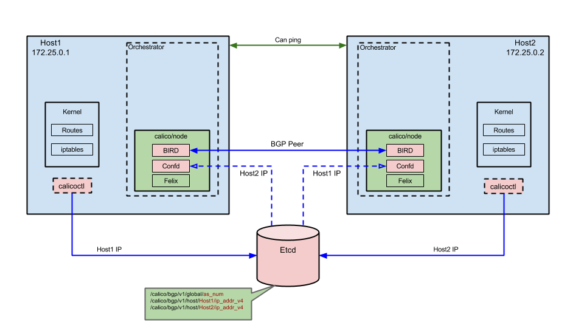
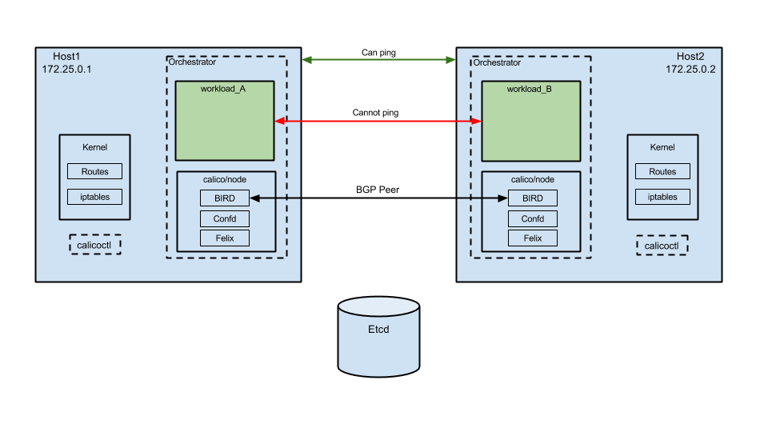

<!--- master only -->
>  This document applies to the HEAD of the calico-docker source tree.
>
> View the calico-docker documentation for the latest release [here](https://github.com/projectcalico/calico-docker/blob/v0.9.0/README.md).
<!--- else
> You are viewing the calico-docker documentation for release **release**.
<!--- end of master only -->

# Lifecycle of a Calico Networked Docker Container

This page provides low-level details about what happens within Calico when 
Docker containers are networked with Calico under default Docker networking. 
We will start with two hosts and end up with containers that can reach one 
another on each host.

This includes information about data added to the etcd datastore, the Felix 
process interacting with the host's route table and iptables rules, and the 
BIRD BGP daemon configuring peers based on confd's reading of etcd datastore 
changes.

Visit the [Calico Components page](./Components.md) for more information about 
the different components that make up a Calico instance (such as Felix, BIRD, 
etcd, and confd).

This page is split up by the user actions and how Calico responds to each 
action below:
  - Start Calico on two hosts
  - Create and add containers to Calico
  - Configure endpoints for each container
  - Create a Calico policy profile
  - Associate the Calico endpoints with the profile

This example utilizes Docker default networking, which differs in some ways 
from using Calico with the Docker libnetwork plugin and other orchestrators 
like Kubernetes, Mesos, and rkt.

## Start the calico/node instance on your container hosts

The `calico/node` Docker image must be running on each host in order to run the 
Calico cluster.

### User starts Calico node

With two hosts on the same network, each host must run the command:

    calicoctl node 

This creates a container called `calico-node`, which uses the `calico/node` 
Docker image.

### Calico Actions
At this point we have a Felix agent, a BIRD BGP daemon, and confd running in the 
calico-node container on each host.

The `calicoctl` tool autodetects the IP addresses of an interface on each host 
(172.25.0.1 on Host1 and 172.25.0.2 on Host2). It then stores the default 
global AS number and the IP addresses of each host as BGP host addresses in 
etcd. The confd process reads these BGP IP addresses and uses a template to 
configure the BGP daemon with BGP peers. The two hosts are BGP peers connected 
in a full mesh using the default global AS number.

### Result
There are currently no workload containers running.  Felix and confd are 
standing by, waiting for changes in the etcd datastore.

`calicoctl` allows you to configure other BGP topologies as well, such as a 
mesh of route reflectors or per-node BGP.  Visit the calico-docker [BGP 
page](https://github.com/projectcalico/calico-docker/blob/master/docs/bgp.md) 
for more details.

## Create Containers on Host

We want to add a container on each host so that we can later network the 
containers to talk to each other.

### User Creates Docker Containers
On each host, the user creates a Docker container using the `docker run` 
command:

    # Host1
    docker run --net=none --name=workload_A -tid ubuntu
    
    # Host2
    docker run --net=none --name=workload_B -tid ubuntu

Two ubuntu workloads have been created, one on each host.  The `--net=none` 
flag means that the containers are not networked through Docker bridged 
networking, so the containers are completely independent and cannot access or 
be accessed by outside sources.

### Calico Actions
None of the Calico processes have performed any new actions at this point.

The workloads have not been added to Calico networking and no security policy 
has been configured.

### Result
The workloads do not yet have connectivity between one another.

Felix and confd are still standing by for changes to the etcd datastore.

**NOTE**: Docker's libnetwork plugin works a bit differently than this 
default-networking example. When using Calico with libnetwork, this step and the 
next three steps in the process all occur at the same time.  The container and 
profile are created simultaneously, the container is added to Calico networking, 
and the profile is set on the container.  Continue reading to learn more about 
what happens under the covers.

## Add Containers to Calico Networking

It is time to network the containers. When networked, containers receive an 
IP address from within a predefined Calico IP pool. The default IP pools for 
Calico are `192.168.0.0/16` for IPv4 and `fd80:24e2:f998:72d6::/64` for IPv6 
(we'll use IPv4 in this example).  

Etcd stores pools as `/calico/v1/ipam/v4/pool/192.168.0.0-16`, where assigned 
IPs in a pool are stored as: `/calico/v1/ipam/v4/assignment/192.168.0.0-16/192.168.1.1`. 
You can view pools by running `calicoctl pool show`.  

See the [`calicoctl pool` reference guide](calicoctl/pool.md) for more 
information on creating, modifying, and removing Calico IP pools.

### User Networks the Workloads

The workloads are added to Calico networking by calling the command:

    calicoctl container add <container_id> <ip>

where `<container_id>` is the ID or name of the Docker container and `<ip>` 
is an IP address falling within a configured Calico pool (eg. `192.168.1.1`), a 
CIDR representing an existing Calico pool (eg. `192.168.0.0/16`), or the ip 
address version to use (`ipv4` or `ipv6`).

With this in mind, we run the following commands:

    # Host1
    calicoctl container add workload_A 192.168.1.1
    
    # Host2
    calicoctl container add workload_B 192.168.1.2

See the [`calicoctl container` reference](calicoctl/container.md) for a list of 
all `calicoctl container` commands with their usages and examples.

### Calico Actions
When a workload is added to Calico using `calicoctl`, the tool checks the etcd 
datastore to confirm that the IP value passed in coincides with a previously 
defined IP pool. It then creates a veth pair on the host for the new endpoint, 
storing one end in the host's network namespace and moving the other end into 
the container.  This creates a new interface within the container.

After successfully creating the veth pair, `calicoctl` saves all of the 
follwoing data about the container within etcd:
  - workload id 
  - endpoint id
  - the endpoint's assigned IP
  - the host's IP
  - the MAC address of the container's new veth interface
  - the name of the veth on the host's end

The are stored in etcd as:

    # KEY
    /calico/v1/host/Host1/workload/docker/<workload_id>/endpoint/<endpoint_id>
    
    # VALUE
    {
     "ipv6_gateway": null,
     "state": "active",
     "name": "<host_veth_name>",
     "ipv4_gateway": "<host_ip>",
     "ipv6_nets": [], "profile_ids": [],
     "mac": "<container_mac>",
     "ipv4_nets": ["<assigned_ip>"]
    }

Felix reads the changes in etcd, then programs routes to the container's 
IP address via the host's veth.  Felix also, by default, programs ACLs into the 
host's Linux kernel ip tables that drop all traffic to the container. A policy 
profile will be used to configure inbound and outbound traffic rules later (see below).

BIRD sees that new routes have been added to the host's routing table.  BIRD 
distributes these routes to all of its BGP peers, such as Host2.

### Result
At this point there is still no connectivity between containers as no network 
policy has been configured.

## Create a Profile

A profile represents a security policy that can be applied to any number of 
containers in the Calico network.  A profile is required in order for nodes to 
be able to communicate with one another and to access the internet.

Profiles can be modified to allow or deny specific kinds of traffic, such as 
`allow tcp from ports 80,443 tag PROFILE`.  Profiles have an implicit `deny` 
rule at the end of the list of allow rules, so an `allow` rule is required for 
all desired connections.

### User adds Calico Profile

The profile can be created from any host in the network by calling:

    calicoctl profile add <profile>

The profile is then visible and able to be used by any of the hosts to 
associate the profile with a workload.

On Host1, we run:

    calicoctl profile add PROF_A_B

### Calico Actions
Felix and BIRD have not done anything.  

The libcalico library within calicoctl adds an entry into etcd for the profile 
with default rules.  

The profile's `rules` data is stored in etcd as:

    # /calico/v1/policy/profile/<profile_name>/rules
    {
      "id": <profile_name>
      "inbound_rules": [<rule>, ...],
      "outbound_rules": [<rule>, ...]
    }

where a `<rule>` is of format:

    {
      "protocol": "tcp|udp|icmp|icmpv6",
      "src_tag": "<tag_name>",
      "src_net": "<CIDR>",
      "src_ports": [1234, "2048:4000"],
      "dst_tag": "<tag_name>",
      "dst_net": "<CIDR>",
      "dst_ports": [1234, "2048:4000"],
      "icmp_type": <int>,
      "action": "deny|allow",
    }

Rules can be configured to allow/deny any of the policy components listed above.

The profile's `tags` data is stored as:

    # /calico/v1/policy/profile/<profile_name>/tags
    ["PROFILE_NAME", "TAG_A", "TAG_B", ...]

Tags apply to all endpoints associated with this profile, and tags can be used 
in the rules (as shown above).

Here is the output from `calicoctl profile PROF_A_B rule show` for the default 
rules:

    Inbound rules:
       1 allow from tag PROF_A_B
    Outbound rules:
       1 allow

This means that the endpoints associated with this profile will be able to send 
outbound traffic to anywhere, but the containers can only be reached by other 
containers associated with this profile.

For more information on how to create, remove, update, and show profiles, see 
the [`calicoctl profile` reference guide](calicoctl/profile.md).

### Result
After creating the profile, there is still no connectivity between the 
containers because the profile has not yet been associated with any endpoints.

## Update Containers to use the Profile

Setting a profile on a container provides connectivity to the container 
relative to the policy rules of the associated profile(s).  The default rules 
for a profile provide connectivity between endpoints on the same profile.

**NOTE**: Felix deals with endpoints rather than containers, but for simple
containers with a single interface managed using calicoctl, we treat a 
container and endpoint as the same thing.  For more complicated scenarios, 
calicoctl provides commands for managing actual endpoints (see the 
[`calicoctl endpoint` reference guide](calicoctl/endpoint.md) for usage and 
examples).

### User Configures the Profile on each Container

The profile is set on each workload using `calicoctl`:

    # Host1
    calicoctl container workload_A profile set PROF_A_B
    
    # On Host2
    calicoctl container workload_B profile set PROF_A_B

### Calico Actions
When this command is run, the calicoctl tool sets `PROF_A_B` in the endpoint's 
list of profile ids in etcd.

Felix picks up this change to the endpoint and uses the rules of the profile in 
etcd to configure ACLs in the Linux ip tables.

Since this profile is using default rules and has not been modified, the ACLs 
that Felix programs allow all incoming traffic from containers using `PROF_A_B` 
and drop all other inbound traffic.  The ACLs also allow all outbound traffic 
from the containers to any destination.

### Result
Now that the ip tables rules have been configured to allow specific incoming 
traffic, connectivity has been achieved between endpoints!  The containers are 
now able to send any kind of traffic to one another.

## More complicated policy

Calico can go far beyond configuring simple node-to-node connections with one 
profile using basic rules.

Visit the main [calico-docker README page](../README.md) for a full list of Calico 
Documentation, or check out the relevant pages below for more information: 
  - [BGP Configuration](./bgp.md) for managing global, node-to-node, and 
    node-specific BGP peers
  - [Advanced Network Policy](./AdvancedNetworkPolicy.md) to configure 
    security policy between Calico nodes and other networks
  - [etcd Data Model Structure](./etcdStructure.md) for viewing how Calico 
    stores data for network and endpoint configurations
  - [`calicoctl` Reference Guide](./calicoctl.md) explains how the 
    `calicoctl` command line tool can be used to manage your Calico cluster
  - [External Connectivity](./ExternalConnectivity.md) for hosts on their own 
    Layer 2 segment
  - [Logging Configuration](./logging.md) to set logging levels and choose 
    where Calico logs should be stored
