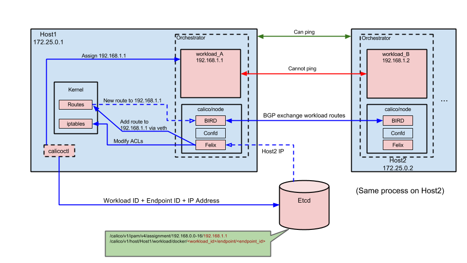
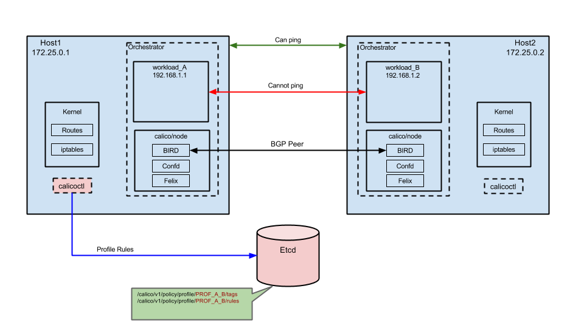
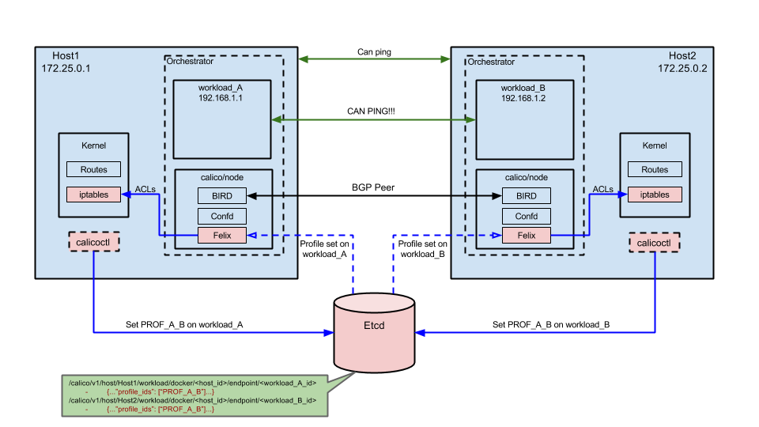

<!--- master only -->
>  This document applies to the HEAD of the calico-docker source tree.
>
> View the calico-docker documentation for the latest release [here](https://github.com/projectcalico/calico-docker/blob/v0.9.0/README.md).
<!--- else
> You are viewing the calico-docker documentation for release **release**.
<!--- end of master only -->

# Lifecycle of a Calico Networked Docker Container
TODO: THIS DOC PROVIDES A LOW-LEVEL LOOK AT WHAT HAPPENS IN CALICO WHEN 
CONTAINERS ARE CREATED/ADDED TO CALICO/ASSIGNED A PROFILE.

TODO: MAKE NOTE TO ADD DOCS FOR OTHER ORCHESTRATOR PLUGINS??

TODO: SPLIT EACH SECTION UP (background, user actions, system responses)

Below is an example of what happens behind the scenes when you start Calico on 
two hosts, create and add containers to Calico, and configure endpoints with 
security policy for each container.  This example utilizes Docker default 
networking, which differs in some ways from using Calico with the Docker 
libnetwork plugin and other orchestrators like Kubernetes, Mesos, and rkt.

### Start the calico/node instance on your container hosts

With two hosts on the same network, on each host, the `calicoctl node` command 
is run.  This creates a container called `calico-node`, which uses the 
`calico/node` Docker image.

At this point we have a Felix agent, a BIRD BGP daemon, and confd running in the 
calico-node container on each host. The `calicoctl` command stores the default 
global AS number and the IP address of each host as BGP host addresses in etcd. 
The confd process reads these BGP IP addresses and uses a template to configure 
the BGP daemon with BGP peers.  The two hosts are BGP peers connected in a full 
mesh using the default global AS number.

There are currently no workload containers running and Felix is standing by, 
waiting for changes in the etcd datastore.

calico-docker allows you to configure other BGP topologies as well, such as a 
mesh of route reflectors or per-node BGP.  Visit the calico-docker [BGP 
page](https://github.com/projectcalico/calico-docker/blob/master/docs/bgp.md) 
for more details.

### Create Containers on Host

Two containers are created using the orchestrator (such as running
`docker run --name=workload_A -tid ubuntu`).  The workloads have not been added 
to Calico networking and no security policy has been configured at this point, 
so they do not yet have connectivity or Calico-assigned IP addresses.  

The workloads do not have connectivity between one another, but they can access 
the internet via the Docker bridge interface. None of the Calico processes have 
performed any new actions at this point.

TODO: DOCUMENT --net=none for simplicity (what we have in our demo)

**Note**: Docker's libnetwork plugin works a bit differently than this 
default-networking example. When using Calico with libnetwork, this step and the 
next three steps in the process all occur at the same time.  The container and 
profile are created simultaneously, the container is added to Calico networking, 
and the profile is set on the container.  Continue reading to learn more about 
what happens under the covers.

### Add Containers to Calico Networking

The workloads are added to Calico networking by calling:

    calicoctl container add <container_id> <ip>

TODO: UPDATE TO BE AWARE OF DIFFERENT OPTIONS FOR <IP>

The `<container_id>` can be either the name of the container or the container's 
workload id.  The `<ip_address>` must be an address that falls within a 
configured IP pool.  The default IP pools for Calico are `192.168.0.0/16` for 
IPv4 and `fd80:24e2:f998:72d6::/64` for IPv6 (we'll use IPv4 in this example). 
You can view pools by running `calicoctl pool show`. To add a new pool, run 
`calicoctl pool add <cidr>` or `calicoctl pool range add <start_ip> <end_ip>`. 
Etcd stores pools as `/calico/v1/ipam/v4/pool/192.168.0.0-16`, where assigned 
IPs in a pool are stored as: `/calico/v1/ipam/v4/assignment/192.168.0.0-16/192.168.1.1`.

When a workload is added to Calico using `calicoctl`, the tool checks the etcd 
datastore to confirm that the IP address passed in falls under a previously 
defined IP pool. It then creates a veth pair on the host for the new endpoint, 
storing one end in the host namespace and moving the other end into the 
container.  After successfully creating the veth pair, `calicoctl` saves the 
workload id, the endpoint id, the endpoint's assigned IP, the host's IP, the 
container's new veth MAC address, and the name of the veth on the host's end 
to the etcd datastore as:

    # KEY
    /calico/v1/host/Host1/workload/docker/<workload_id>/endpoint/<endpoint_id>
    
    # VALUE
    {
     "ipv6_gateway": null,
     "state": "active",
     "name": "<host_veth_name>",
     "ipv4_gateway": "<host_ip>",
     "ipv6_nets": [], "profile_ids": [],
     "mac": "<container_mac>",
     "ipv4_nets": ["<assigned_ip>"]
    }

Felix reads the changes in etcd. Felix then programs routes to the container's 
IP address via the host's veth.  Felix also, by default, programs ACLs into the 
host's Linux kernel ip tables that drop all traffic to the container. A security 
profile will be used to configure inbound and outbound traffic rules later (see below).

BIRD sees that new routes have been added to the host's routing table.  BIRD 
distributes these routes to all of its BGP peers, such as Host2.

At this point there is no connectivity between containers as no network policy 
has been configured.

<!--
*** mention that this is the default Docker networking example, when running with an orchestrator
such as powerstrip, libnetwork, kubernetes the containers may be automatically added to the Calico
network as part of the container creation.  In these cases, the orchestrator plugin modules provide
the same function as the calicoctl commands for explicitly adding the container to the Calico network.
-->

### Create a Profile
<!--
What is a profile, where is it configured, how is it configured
-->

A profile represents a security policy that can be applied to any number of 
containers in the Calico network.  A profile is required in order for nodes to 
be able to communicate with one another and to access the internet.

Profiles can be modified to allow or deny specific kinds of traffic, such as 
`allow tcp from ports 80,443 tag PROFILE`.  Profiles have an implicit `deny` 
rule at the end of the list of allow rules, so an `allow` rule is required for 
all desired connections.

The profile can be created from any host in the network by calling 
`calicoctl profile add <profile>`.  The profile is then visible and able to be 
used by any of the hosts to assign the profile to a workload.

A new data point is added to etcd for the profile with associated rules and tags.

The `rules` data is stored as:

    {
      "inbound_rules": [<rule>, ...],
      "outbound_rules": [<rule>, ...]
    }

where a `<rule>` is of format:

    {
      "protocol": "tcp|udp|icmp|icmpv6",
      "src_tag": "<tag_name>",
      "src_net": "<CIDR>",
      "src_ports": [1234, "2048:4000"],
      "dst_tag": "<tag_name>",
      "dst_net": "<CIDR>",
      "dst_ports": [1234, "2048:4000"],
      "icmp_type": <int>,
      "action": "deny|allow",
    }

Rules can be configured to allow/deny any of the policy components listed above.

The `tags` data is stored as:

    ["PROF_NAME", "TAG_A", "TAG_B", ...]

Tags apply to all endpoints associated with this profile, and tags can be used 
in the rules (as shown above).

In the diagram below, a profile named `PROFILE_A_B` is created by `Host1` by 
calling `calicoctl profile add PROF_A_B`.

After creating the profile, there is still no connectivity between the 
containers because the profile has not yet been associated with any endpoints.

Felix has not done anything, BIRD has not done anything, the libcalico library 
within calicoctl has added an entry into etcd for the profile with default rules.  
Here is the output from `calicoctl profile PROF_A_B rule show` for the default 
rules:

    Inbound rules:
       1 allow from tag PROF_A_B
    Outbound rules:
       1 allow

### Update Containers to use the Profile

<!--
TODO: Ask about this.
Mention that Felix deals with Endpoints rather than containers, but for simple
containers with a single interface managed using calicoctl - we treat a container and
endpoint as the same thing.  For more complicated scenarios, calicoctl provides
commands for managing actual endpoints.
-->

Setting a profile on a container gives the container a security policy.  On each 
workload, the profile is set using calicoctl:

    # On Host1
    calicoctl container workload_A profile set PROF_A_B
    
    # On Host2
    calicoctl container workload_B profile set PROF_A_B

When this command is run, the calicoctl tool sets `PROF_A_B` in etcd's list of 
profiles associated with the endpoint id.  Felix picks up this change and uses 
the rules of the profile in etcd to configure ACLs in the Linux ip tables.

Since this profile is using default rules and has not been modified, the ACLs 
that Felix programs allow all incoming traffic from containers using `PROF_A_B` 
and drop all other inbound traffic.  The ACLs also allow all outbound traffic 
from the containers to any destination.

Now that the ip tables have been configured to allow specific incoming traffic, 
connectivity has been achieved between endpoints!

<!-- 
- etcd adds profile id to list of profiles associated with the endpoint_id

*** What does Felix do:

- Felix configures the Linux ip tables for endpoints based on the policy 
  described in the profile.  By default, this will allow all outgoing traffic 
  and all incoming traffic between containers/endpoints on the profile, but 
  deny all other incoming traffic.
TODO: Is this done using the interface or IP of the container?  How is the
rule applied to each endpoint?
-->

### More complicated policy

***TODO: Per node BGP, specific allow/deny, multiple profiles, 
- libnetwork differences.